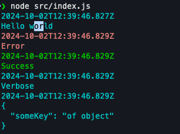

NodeJS lib to log



```js
import { consoleLog } from "@orensayag/logger"

consoleLog({
  "message": "Hello world"
})
consoleLog({
  "message": "Error",
  "logType": "ERROR"
})
consoleLog({
  "message": "Success",
  "logType": "SUCCESS"
})
consoleLog({
  "message": "Verbose",
  "logType": "VERBOSE"
})
consoleLog({
  "message": {
    someKey: "of object"
  }
})

```
